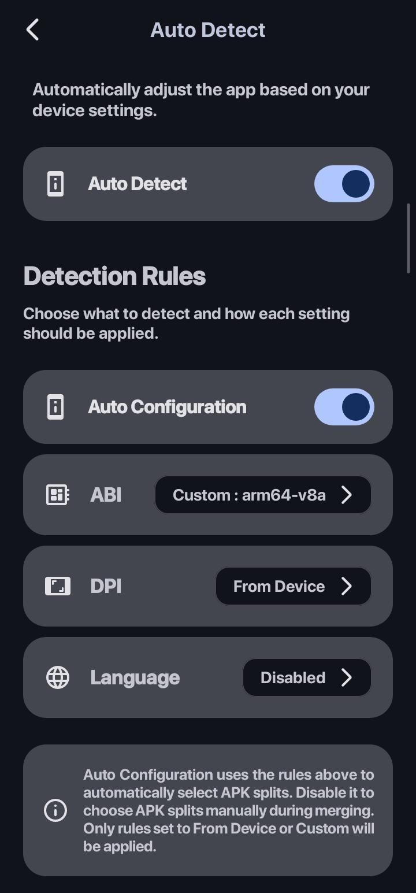
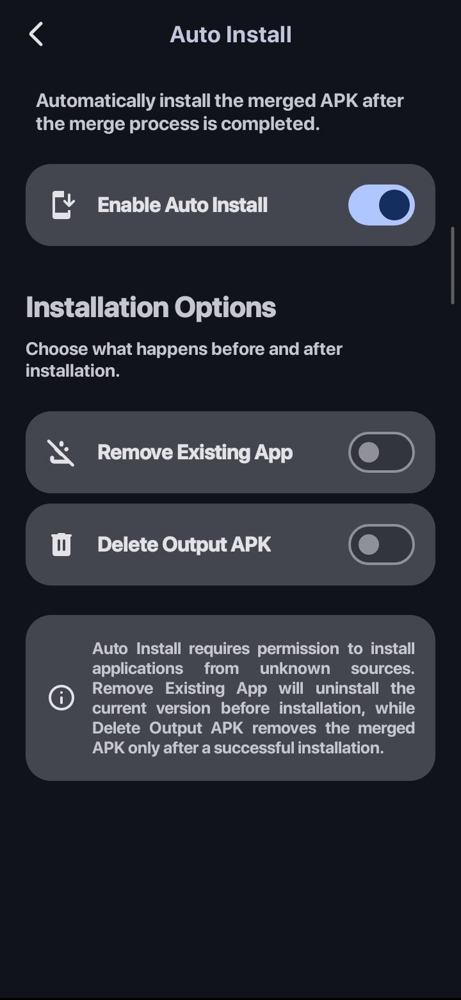
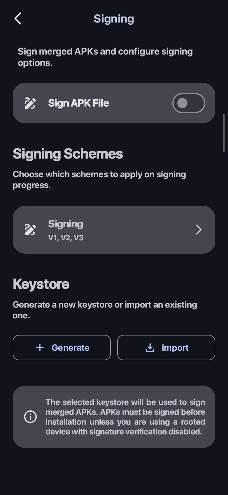
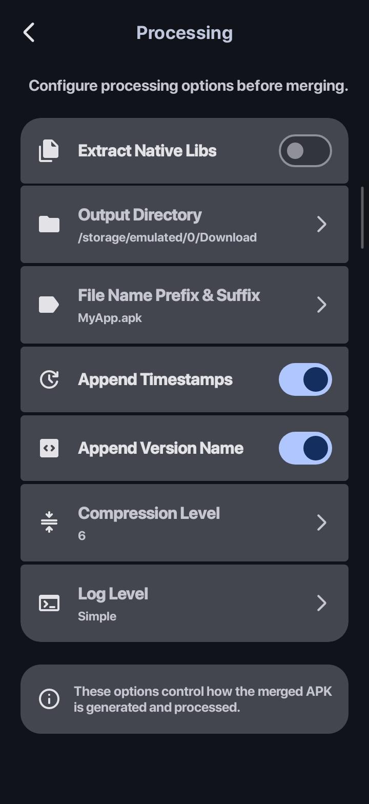

# 🚀 Mergify: APK Splits Merger

An open-source Android application for rebuilding split APK packages into a single, signed,
installable APK directly on your device.

Mergify supports **APKS, XAPK, and APKM** packages, automatically detects available split APK
components, and provides flexible controls for device configuration, split selection, APK signing,
output customization, and installation.

Whether you want to automatically configure your APK based on your device or manually select the
exact splits you want to include, Mergify gives you full control over the APK reconstruction
process.

---

## 🔗 Project Links

* 📦 Source Code:
  [GitHub Repository](https://github.com/szn0506/Merger-App/tree/master)
* 📥 Download:
  [GitHub Releases](https://github.com/szn0506/Merger-App/releases)

---

## ✨ Features

Mergify's main functionality is organized into four major feature areas:

* 🎯 **Auto Detect** — Automatically configure APK splits based on your device
* 📲 **Auto Install** — Install the generated APK and optionally remove the existing application
* ✍️ **Signing** — Sign generated APKs with configurable signing schemes and keystores
* ⚙️ **Processing** — Configure APK processing, output, compression, filenames, and logs

<h3>🎯 Auto Detect & Split Configuration</h3>

Mergify provides flexible ways to determine which APK splits should be included in the final output.

### 🔍 Auto Detect

When enabled, Mergify automatically detects the device configuration, including:

* ABI
* DPI
* Language

The detected configuration is then used to determine the appropriate APK splits for the generated
output.

This allows the resulting APK to be tailored to the target device without requiring manual split
selection.

### ⚙️ Auto Config

Auto Config provides more granular control over split configuration.

ABI, DPI, and Language can each be configured independently using options such as:

* **From Device** — Automatically use the detected device configuration
* **Disabled** — Disable the corresponding split type
* **Custom** — Manually specify the desired configuration

This allows users to combine automatic device detection with manual configuration when needed.

### 🧩 Split Picker

When Auto Config is disabled, Mergify provides a Split Picker before the merge process begins.

Users can manually select which available APK splits should be included in the final output.

This provides complete control over the components included in the generated APK.

### 📦 Split APK Reconstruction

Mergify is designed to rebuild split APK packages into standalone APK files.

* Automatic split APK detection
* ABI split filtering
* DPI split filtering
* Language split filtering
* Standalone APK generation
* Optional native library extraction
* Configurable compression level

### 📱 APK Import & Extraction

Choose how you want to provide the APK package:

* 📁 Import packages using direct file paths
* 📱 Extract APKs directly from installed applications
* 📂 Import packages through Android Storage Access Framework (SAF)

Mergify can discover visible installed applications through Android's package visibility system. The
application filters the available packages to identify non-system applications containing split APK
components, allowing users to select an installed application and extract its base APK and split
APKs for further processing.

---

<h3>📲 Auto Install</h3>

Mergify can automatically initiate the installation process after the APK has been successfully
merged.

### ⚡ Auto Install

When enabled, Mergify requests the Android Package Installer immediately after the merge process
completes.

The final installation decision remains under the control of the user and Android's package
installation system. Mergify only requests the installation through the appropriate Android
permission.

Mergify does not silently install applications.

### 🗑️ Remove Existing App

Mergify can optionally request the removal of the existing installed application before installing
the newly generated APK.

This can be useful when the generated APK has a different signing certificate from the original
installed application.

The feature uses Android's package deletion request mechanism and still requires confirmation
through the Android system where applicable.

### 🧹 Delete Output APK

When enabled, Mergify automatically deletes the generated APK file from storage after the
installation process.

This option is only available when **Auto Install** is enabled.

### 🔐 Installation Requirements

The Auto Install feature requires permission to install applications from unknown sources.

For APKs that are not signed, standard Android installation requirements still apply. Devices using
modified environments or signature verification patches may behave differently from standard Android
devices.

---

<h3>✍️ APK Signing</h3>

Mergify includes built-in APK signing configuration with support for multiple signing schemes and
keystore management.

### 🔐 Signing

Signing can be enabled or disabled depending on the user's requirements.

When signing is enabled, users can select the signing schemes to use:

* V1
* V2
* V3
* V4

### 🗝️ Keystore Management

Mergify allows users to manage signing keystores directly from the application.

Supported operations include:

* Generate a new keystore
* Import an existing keystore
* Select a previously imported or generated keystore
* Use the selected keystore to sign generated APKs

Currently supported keystore format:

* **PKCS#12 (`.p12`)**

### ⚠️ Unsigned APKs

Unsigned APKs generally cannot be installed through the standard Android installation process.

On modified or rooted Android environments with signature verification changes, installation
behavior may differ from standard Android devices.

Mergify itself does not include or require any signature verification bypass mechanism.

---

<h3>⚙️ Processing & Output Configuration</h3>

Mergify provides additional configuration options for controlling the APK reconstruction and output
process.

### 📚 Extract Native Libraries

Users can enable or disable native library extraction during APK processing.

This option exposes the corresponding APKEditor processing configuration directly to the user.

### 📁 Output Directory

Users can configure where generated APK files are stored.

The default output directory is the device's **Download** folder.

### 📝 File Name Customization

Generated APK filenames can be customized using:

* **File Name Prefix**
* **File Name Suffix**
* **Append Timestamp**
* **Append Version Name**

These options allow users to create more descriptive output filenames and avoid filename conflicts
when generating multiple APKs.

### 🗜️ Compression Level

Users can configure the compression level used during APK output processing.

### 📜 Log Level

Mergify provides configurable logging levels:

* **Default**
* **Simple**

The selected log level controls the amount and style of processing information displayed during APK
reconstruction.

---

## 🎨 Appearance & Personalization

Mergify provides a modern Android interface with customizable appearance options.

### 🌈 Material You

Mergify supports Material You and Dynamic Color on supported Android versions, allowing the
application's interface to adapt to the device's system color palette.

### 🌑 Dark Mode

A dark appearance is available for users who prefer a darker interface.

### 🖤 Pure Black

Mergify also provides a Pure Black theme for a completely black interface.

### 🌍 Multi-Language Support

Mergify supports multiple languages and allows users to either follow the system language or select
a language manually.

Available languages:

* System
* English
* العربية
* Deutsch
* Español
* Français
* हिन्दी
* Indonesia
* Italiano
* 日本語
* 한국어
* Bahasa Melayu
* Português
* Русский
* Türkçe
* Tiếng Việt
* 中文

---

## 📋 Supported Formats

| Format | Support |
| ------ | ------- |
| APKS   | ✅       |
| XAPK   | ✅       |
| APKM   | ✅       |

Mergify is focused on processing split APK packages and reconstructing their components into a
standalone APK.

---

## ⚙️ How It Works

A typical Mergify workflow looks like this:

1. Select an **APKS, XAPK, or APKM** package, or extract APKs from an installed application.
2. Mergify analyzes the available APK split components.
3. Configure the desired device and split behavior using **Auto Detect**, **Auto Config**, or the *
   *Split Picker**.
4. Compatible ABI, DPI, and language splits are selected according to the configured options.
5. Configure processing and output options if required.
6. Optionally configure APK signing and select a keystore.
7. Mergify reconstructs the selected APK components into a standalone APK.
8. The generated APK is signed if signing is enabled.
9. The final APK is saved to the configured output directory.
10. If **Auto Install** is enabled, Mergify requests Android's package installer to install the
    generated APK.
11. If configured, the existing application can be requested for removal before installation.
12. If **Delete Output APK** is enabled, the generated APK file is removed after the installation
    process.

---

## 📸 Screenshots

### Main Features

### Application Screens

<table>
  <tr>
    <td align="center">
      
    </td>
    <td align="center">
      
    </td>
    <td align="center">
      
    </td>
    <td align="center">
      
    </td>
  </tr>
  <tr>
    <td align="center">
      
    </td>
    <td align="center">
      
    </td>
    <td align="center">
      
    </td>
    <td align="center">
      
    </td>
  </tr>
</table>

Click any screenshot to view the full-size image.

---

## 🔐 Permissions

### `READ_EXTERNAL_STORAGE`

Used to read APK split packages and supported files from external storage on supported Android
versions.

### `WRITE_EXTERNAL_STORAGE`

Legacy storage permission used for writing generated APK files on Android 9 (API 28) and below.

### `MANAGE_EXTERNAL_STORAGE`

Provides broad file-system access for direct file imports and APK output generation without relying
exclusively on Android's document picker.

### `REQUEST_INSTALL_PACKAGES`

Required to request APK installation through Android's package installer.

Mergify does not silently install applications. The final installation process is handled by
Android's package installation system and may require user confirmation.

### `REQUEST_DELETE_PACKAGES`

Used to request removal of an existing installed application when the **Remove Existing App** option
is enabled.

Android may still require user confirmation before the application is removed.

### Package Visibility

Mergify uses Android's package visibility mechanism to discover visible installed applications that
expose a launcher activity.

The application filters the available packages to identify non-system applications containing split
APK components, allowing users to select an installed application and extract its base APK and split
APKs for further processing.

Mergify does not require the broad `QUERY_ALL_PACKAGES` permission for this functionality.

---

## 📱 Requirements

* Android 10 (API 29) or higher
* A device capable of installing APK packages
* Permission to install applications from unknown sources when using the Auto Install feature

---

## ❤️ Open Source Credits

Mergify is built using and incorporates the following open-source projects and libraries.

### APKEditor — REAndroid

Used for APK processing, package reconstruction, and split APK merging.

Repository:
https://github.com/REAndroid/APKEditor

License:
Apache License 2.0

### ARSCLib — REAndroid

Part of the APKEditor ecosystem and included through the APKEditor integration.

Repository:
https://github.com/REAndroid/ARSCLib

License:
Apache License 2.0

### Android APK Signature Library — ApkSig

Used for APK signing and signature generation.

Repository:
https://android.googlesource.com/platform/tools/apksig/

License:
Apache License 2.0

### AndroidX AppCompat

Used for Android application compatibility and UI framework support.

Repository:
https://github.com/androidx/androidx/tree/androidx-main/appcompat

License:
Apache License 2.0

### Material Components for Android

Used for Material Design UI components and application interface elements.

Repository:
https://github.com/material-components/material-components-android

License:
Apache License 2.0

### Material Symbols

Some icons used in the Mergify user interface are sourced from Google Material Symbols.

Website:
https://fonts.google.com/icons

License:
Apache License 2.0

### Bouncy Castle

Used for cryptographic functionality.

Repository:
https://github.com/bcgit/bc-java

License:
MIT License

---

All third-party libraries and projects remain the property of their respective authors and
contributors. Their use in Mergify is subject to the terms and conditions of their respective
licenses.

Testing-only dependencies, including JUnit and Espresso, are not listed above as they are used
exclusively for application testing and are not part of the application's runtime functionality.

---

## ⚠️ Important Notes

### APK Signing

When an APK is rebuilt and signed with a different signing key from the original application,
Android treats it as a different signing identity.

As a result, an existing installation of the original application may need to be removed before the
newly generated APK can be installed.

Mergify provides the **Remove Existing App** option to assist with this workflow through Android's
package deletion request system.

### Unsigned APKs

Unsigned APKs generally cannot be installed through the standard Android installation process.

On modified or rooted Android environments with signature verification changes, installation
behavior may differ from standard Android devices.

Mergify itself does not include or require any signature verification bypass mechanism.

---

## ⚠️ Disclaimer

Mergify is intended for educational, research, interoperability, and APK package management
purposes.

Users are responsible for complying with software licenses, distribution terms, copyright
requirements, and applicable laws when processing APK packages.

Mergify does not distribute third-party APKs and does not bypass Android security mechanisms.

Users are responsible for ensuring that they have the necessary rights and permissions to process
any APK packages used with the application.

---

## 📄 License

Mergify is licensed under the **Apache License, Version 2.0**.

See the [`LICENSE`](LICENSE) file for the full license text.
