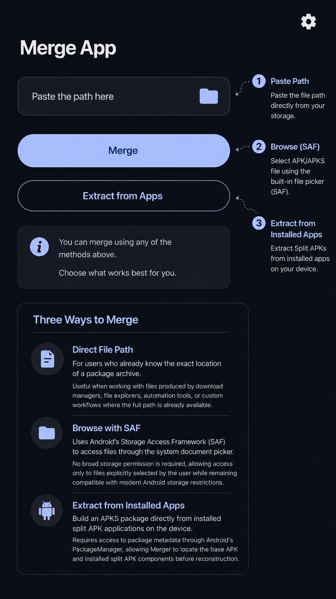
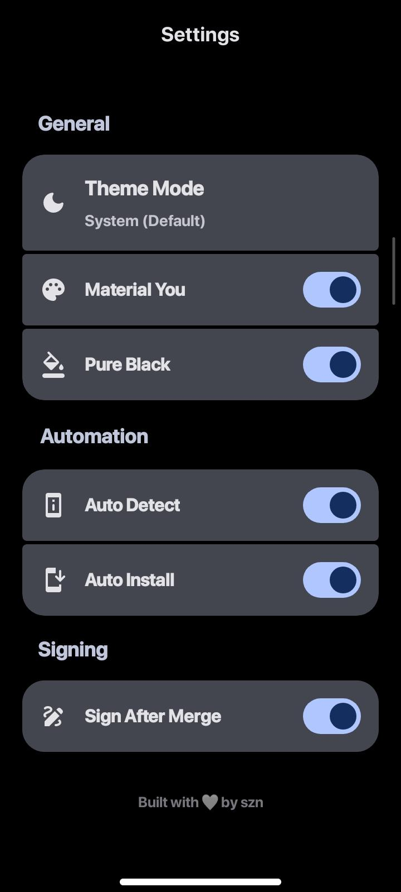
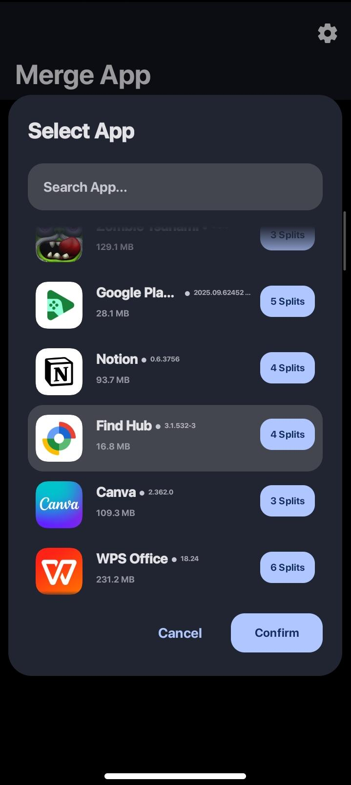
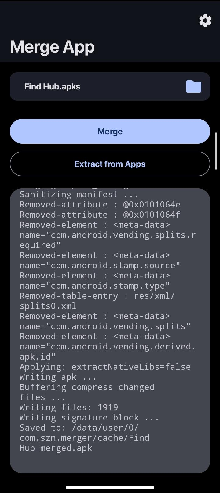

# 🚀 Merger App

An Android application for rebuilding split APK packages into a single installable APK directly on your device.

Merger supports APKS, XAPK, and APKM packages, automatically detects required split APK components, and generates a signed standalone APK ready for installation.

---

## ✨ Features

### 📱 APK Extraction & Import

Choose the method that works best for you:

* 📱 Extract APKs directly from installed applications
* 📁 Import package files using direct file paths
* 📂 Import package files through Android Storage Access Framework (SAF)

### 🔧 APK Reconstruction

* Support for APKS, XAPK, and APKM packages
* Automatic split APK detection
* ABI split filtering
* DPI split filtering
* Standalone APK generation
* APK signing support

### 🎨 Modern Android UI

* Material Design 3 interface
* Material You support (Android 12+)
* Dynamic Color support
* Dark mode support
* Pure Black theme support

---

## 📋 Supported Formats

| Format | Support |
| ------ | ------- |
| APKS   | ✅       |
| XAPK   | ✅       |
| APKM   | ✅       |

---

## 📸 Screenshots

### Main Features

### Application Screens

  

  

  

  

Click any screenshot to view the full-size image.

---

## ⚙️ How It Works

1. Select an APKS, XAPK, or APKM package, or extract APKs from an installed application.
2. Merger analyzes available split APK components.
3. Compatible ABI and DPI splits are selected automatically.
4. The package is rebuilt into a standalone APK.
5. The generated APK is signed and prepared for installation.

---

## 🔐 Permissions

### READ_EXTERNAL_STORAGE

Used for reading APKS, XAPK, and APKM files stored on external storage on supported Android versions.

### WRITE_EXTERNAL_STORAGE (Android 9 and below)

Legacy storage permission used for writing generated APK files on older Android versions.

### MANAGE_EXTERNAL_STORAGE

Provides broad file-system access for direct file imports and APK output generation without relying exclusively on Android's document picker.

### REQUEST_INSTALL_PACKAGES

Required for launching Android's package installer after APK generation is complete.

Without this permission, Android prevents applications from initiating APK installation requests.

---

## ❤️ Open Source Credits

### APKEditor (REAndroid)

Used for APK processing, package rebuilding, and split APK merging.

Repository:

https://github.com/REAndroid/APKEditor

License:

Apache License 2.0

### ARSCLib (REAndroid)

Used by APKEditor for Android resource table parsing and manipulation.

Repository:

https://github.com/REAndroid/ARSCLib

License:

Apache License 2.0

### Android APK Signature Library (apksig)

Used for APK signing and signature generation.

Repository:

https://android.googlesource.com/platform/tools/apksig

License:

Apache License 2.0

### Material Components for Android

Used for Material Design UI components.

Repository:

https://github.com/material-components/material-components-android

License:

Apache License 2.0

### Material Symbols

Used for icons and visual assets.

Repository:

https://github.com/google/material-design-icons

License:

Apache License 2.0

---

## 📱 Requirements

* Android 10 (API 29) or higher

---

## ⚠️ Disclaimer

This project is intended for educational, research, interoperability, and APK package management purposes.

Users are responsible for complying with software licenses, distribution terms, copyright requirements, and applicable laws when processing APK packages.

This project does not distribute third-party APKs and does not bypass Android security mechanisms.

A debug signing key is bundled with the application for convenience. It is intended only for locally generated APKs and must not be used for production releases

---

## 📄 License

Licensed under the Apache License, Version 2.0.

See the LICENSE file for details.
